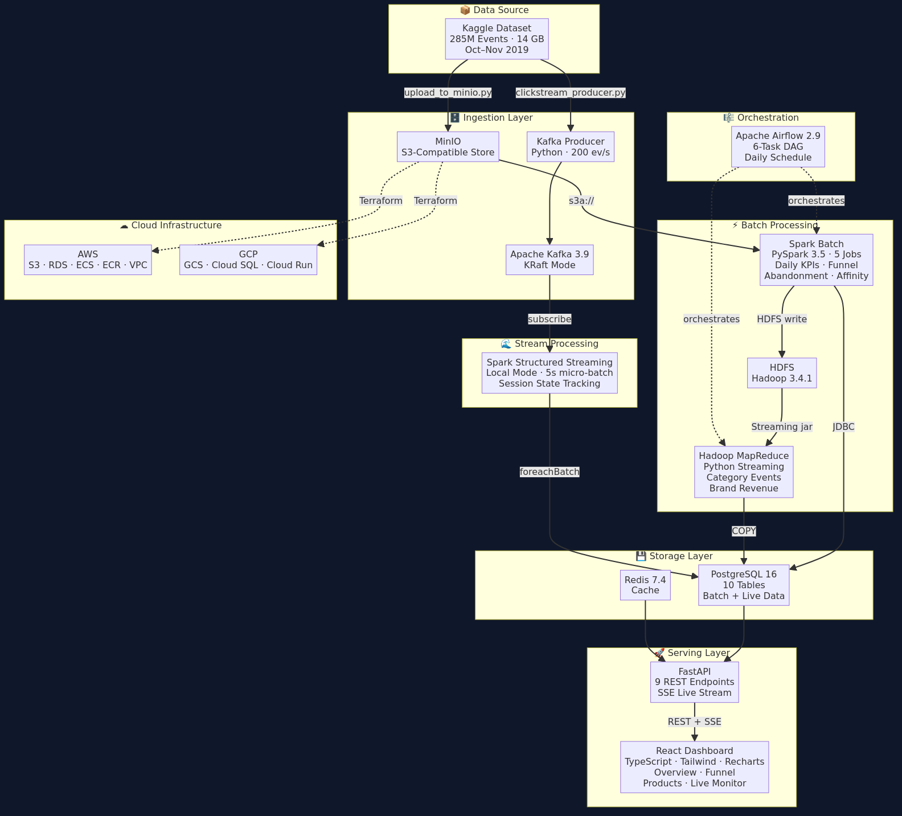
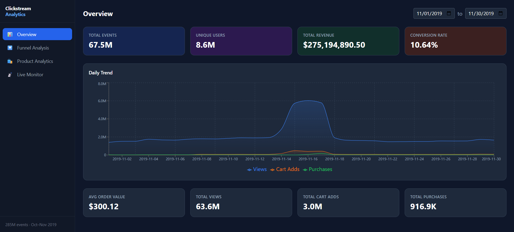
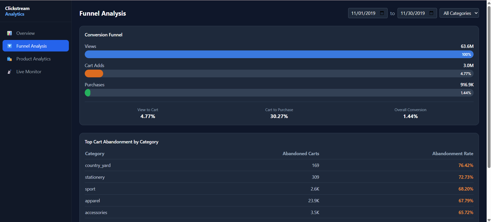
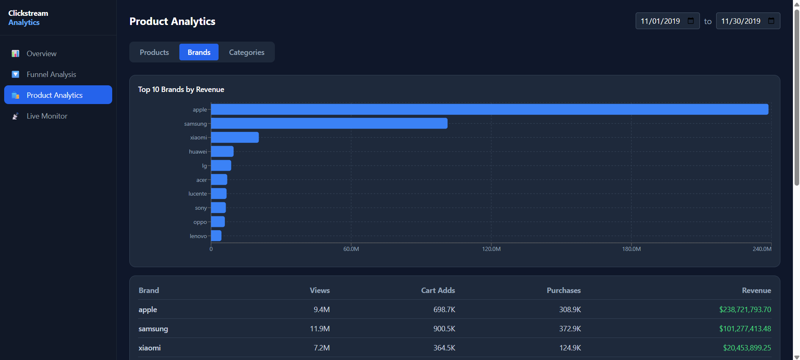
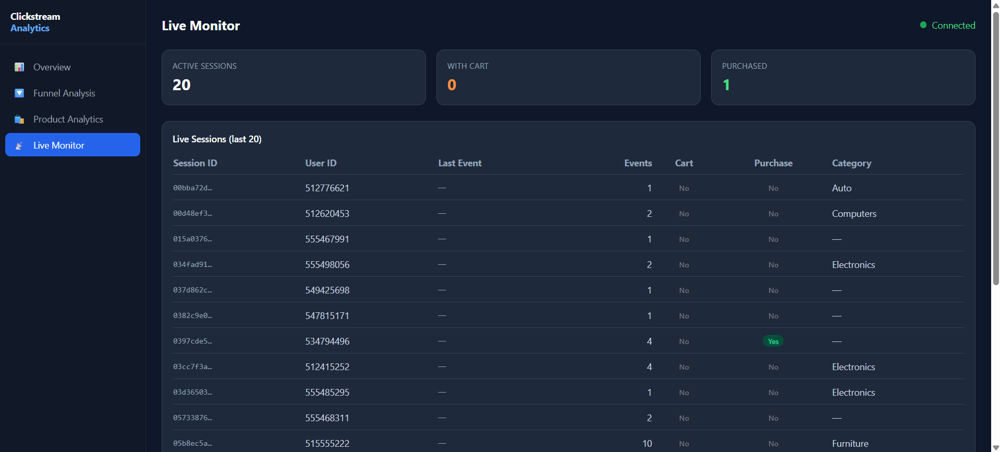

# E-Commerce Clickstream Analytics Platform


A production-grade portfolio data engineering project by **Hassan Zaib Hayat**, processing 285 million e-commerce clickstream events using a modern data stack.

---

## Architecture



<details>
<summary>View Mermaid source</summary>

See [docs/architecture.mermaid](docs/architecture.mermaid)

</details>

---

## Dataset

**Kaggle:** [eCommerce behavior data from multi category store](https://www.kaggle.com/datasets/mkechinov/ecommerce-behavior-data-from-multi-category-store)

- ~285 million events
- 14 GB CSV
- Oct–Nov 2019
- Fields: `event_time`, `event_type`, `product_id`, `category_id`, `category_code`, `brand`, `price`, `user_id`, `user_session`

---

## Tech Stack

| Component     | Technology                              | Version  |
|--------------|------------------------------------------|----------|
| Batch ETL    | Apache Spark                            | 3.5      |
| Stream ETL   | Spark Structured Streaming + Kafka      | 3.5 / 3.9 |
| MapReduce    | Apache Hadoop YARN Streaming            | 3.4.1    |
| Orchestration| Apache Airflow                          | 2.9.3    |
| Object Store | MinIO (S3-compatible)                   | 2024-11  |
| Database     | PostgreSQL                              | 16.3     |
| Message Bus  | Apache Kafka (KRaft)                    | 3.9.0    |
| Cache        | Redis                                   | 7.4.1    |
| API          | FastAPI + asyncpg                       | 0.115.5  |
| Frontend     | React + TypeScript + Tailwind + Recharts| 18.3     |
| IaC          | Terraform (AWS + GCP)                   | >=1.5    |

---

## Prerequisites

- **Docker Desktop >= 4.30** with **>= 16 GB RAM** allocated to Docker
- **≥ 30 GB free disk space** (14 GB dataset + Docker images + intermediate data)
- **Docker Compose v2** (bundled with Docker Desktop)
- **Git Bash** (Windows) or bash (Linux/macOS)
- **WSL2** (Windows) with at least 12 GB memory limit — set in `%USERPROFILE%\.wslconfig`:
  ```ini
  [wsl2]
  memory=12GB
  ```
- Kaggle dataset downloaded: [eCommerce behavior data from multi category store](https://www.kaggle.com/datasets/mkechinov/ecommerce-behavior-data-from-multi-category-store)

---

## Quick Start

```bash
# 1. Clone and configure
git clone https://github.com/hassanzaibhay/ecommerce-clickstream-platform.git
cd ecommerce-clickstream-platform
cp .env.example .env
# Edit .env — fill in POSTGRES_PASSWORD, MINIO_ROOT_PASSWORD, Airflow keys

# 2. Start all services (approximately 60 seconds for everything to be ready)
make up

# 3. Verify services
make ps

# 4. Upload CSV to MinIO (14 GB — may take several minutes)
make minio-upload CSV_PATH=/path/to/events.csv

# 5. Create HDFS directories
make hdfs-init

# 6. Run the full batch pipeline
make pipeline-batch

# 7. Start live simulation (two terminals)
make kafka-produce    # Terminal 1
make spark-stream     # Terminal 2
```

---

## Service URLs

| Service         | URL                        | Credentials          |
|----------------|----------------------------|----------------------|
| Dashboard       | http://localhost:3000      | —                    |
| FastAPI Docs    | http://localhost:8000/docs | —                    |
| Airflow         | http://localhost:8080      | admin / admin        |
| MinIO Console   | http://localhost:9001      | .env values          |
| Spark Master UI | http://localhost:8081      | —                    |
| HDFS NameNode   | http://localhost:9870      | —                    |
| YARN            | http://localhost:8088      | —                    |

---

## Data Pipeline

### Stage 1 — Batch Analytics (Spark)
1. **batch_analytics.py** — Reads raw CSV from MinIO, computes daily KPIs (events, users, revenue, conversion rate), top products, brands, categories. Writes to PostgreSQL and saves Parquet back to MinIO.
2. **funnel_analysis.py** — Computes per-category funnel rates (view→cart→purchase) per day.
3. **cart_abandonment.py** — Identifies sessions with cart but no purchase; computes abandonment rates.
4. **product_affinity.py** — Co-occurrence and lift scores for product pairs (sampled at 10% for performance).
5. **prepare_mapreduce.py** — Converts Parquet → CSV and uploads to HDFS for Hadoop Streaming.

### Stage 2 — Hadoop MapReduce
- **category_events** — Counts events per (category, event_type).
- **brand_revenue** — Sums revenue and purchase count per brand.

### Stage 3 — Live Streaming
- Kafka producer replays CSV at configurable rate (default 200 events/sec).
- Spark Streaming consumer aggregates active sessions and upserts to `live_sessions` every 5 seconds.

---

## Dashboard Pages

| Page              | Description                                              |
|-------------------|----------------------------------------------------------|
| Overview          | KPI cards, daily trend area chart (views/carts/purchases)|
| Funnel Analysis   | Funnel visualization, cart abandonment by category       |
| Product Analytics | Top products, brands (bar chart), categories (pie chart) |
| Live Monitor      | Real-time session table via SSE, connected/disconnected  |

---

## Makefile Reference

```
make up                - Start all services
make down              - Stop all services
make build             - Rebuild images
make logs              - Tail logs
make ps                - Service status
make minio-upload      - Upload CSV (CSV_PATH=...)
make hdfs-init         - Create HDFS dirs
make spark-batch       - Daily KPIs
make spark-funnel      - Funnel stats
make spark-abandonment - Cart abandonment
make spark-affinity    - Product affinity
make spark-prepare-mr  - Prep for MapReduce
make mapreduce-run     - Hadoop MapReduce jobs
make kafka-produce     - Start Kafka producer
make spark-stream      - Start Spark Streaming
make pipeline-batch    - Full batch pipeline
make pipeline-all      - Full pipeline + live
make lint              - ruff check
make typecheck         - mypy --strict
make test              - pytest
make audit             - lint + typecheck + test
```

---

## Project Structure

```
ecommerce-clickstream-platform/
├── .github/workflows/ci.yml          # GitHub Actions: lint + typecheck + test
├── airflow/dags/batch_pipeline.py    # Airflow DAG — orchestrates full batch pipeline
├── api/                              # FastAPI service (python:3.11-slim)
│   ├── main.py                       # App factory, CORS, health, data-range endpoints
│   ├── database.py                   # asyncpg connection pool + lifespan
│   ├── routers/                      # overview, funnel, products, live
│   └── tests/                        # pytest + httpx + AsyncMock (no real DB)
├── docker/
│   ├── hadoop/Dockerfile             # ubuntu:22.04 + OpenJDK 11 + Hadoop 3.4.1
│   ├── hadoop/bootstrap-*.sh         # NameNode/DataNode init scripts
│   └── kafka/                        # apache/kafka:3.9.0 + KRaft start script
├── frontend/                         # React + TypeScript + Tailwind + Recharts
│   ├── src/pages/                    # Overview, FunnelAnalysis, ProductAnalytics, LiveMonitor
│   ├── src/api/client.ts             # Typed API client + number formatters
│   └── nginx.conf                    # Proxy /api/ → FastAPI, SSE-safe config
├── hadoop/
│   ├── mapreduce/                    # category_events and brand_revenue streaming jobs
│   └── scripts/                     # HDFS init + MapReduce run scripts
├── kafka/producer/clickstream_producer.py  # CSV replay → Kafka @ configurable rate
├── scripts/
│   ├── build.sh                     # DOCKER_BUILDKIT=1 docker compose build
│   ├── spark-submit.sh              # Wrapper: docker compose exec spark-master spark-submit
│   ├── init_db.sql                  # PostgreSQL schema (all 11 tables)
│   ├── load_sample.py               # Upload 1% sample to MinIO for dev
│   └── upload_to_minio.py           # Upload full 14 GB CSV to MinIO
├── spark/
│   ├── jobs/                        # 5 PySpark batch jobs (explicit schemas, env-var config)
│   └── streaming/clickstream_consumer.py  # Kafka → live_sessions via foreachBatch
├── terraform/aws/ and terraform/gcp/     # IaC templates (AWS + GCP)
├── .env.example                     # All env vars with blank sensitive values
├── docker-compose.yml               # All 13 services, healthchecks, networks
└── Makefile                         # All operational targets (Windows-compatible)
```

---

## Development Notes

- `docker-compose.override.yml` is gitignored — use it for local overrides.
- All secrets live in `.env` (gitignored). Never commit `.env`.
- Spark jobs use `--packages` to auto-download PostgreSQL and Kafka JARs on first run (requires internet).
- For development with smaller data, use `make minio-upload CSV_PATH=...` with `scripts/load_sample.py` output (1% sample).

---

## Screenshots

### Overview Dashboard


### Funnel Analysis


### Product Analytics


### Live Monitor


---

## License

MIT License — see [LICENSE](LICENSE) for details.

---

## Author

**Hassan Zaib Hayat**
[github.com/hassanzaibhay](https://github.com/hassanzaibhay)
